# MyFit App - Sitemap por Perfil de Usuário

Este documento apresenta a estrutura de navegação do aplicativo MyFit, organizada por perfil de usuário.

## Índice
1. [Fluxo de Autenticação](#1-fluxo-de-autenticação-comum-a-todos)
2. [Visão Student/Aluno](#2-visão-studentaluno)
3. [Visão Trainer/Coach](#3-visão-trainercoach)
4. [Visão Nutritionist](#4-visão-nutritionist)
5. [Visão Gym Owner/Admin](#5-visão-gym-owneradmin)
6. [Telas Compartilhadas](#6-telas-compartilhadas)

---

## 1. Fluxo de Autenticação (Comum a Todos)

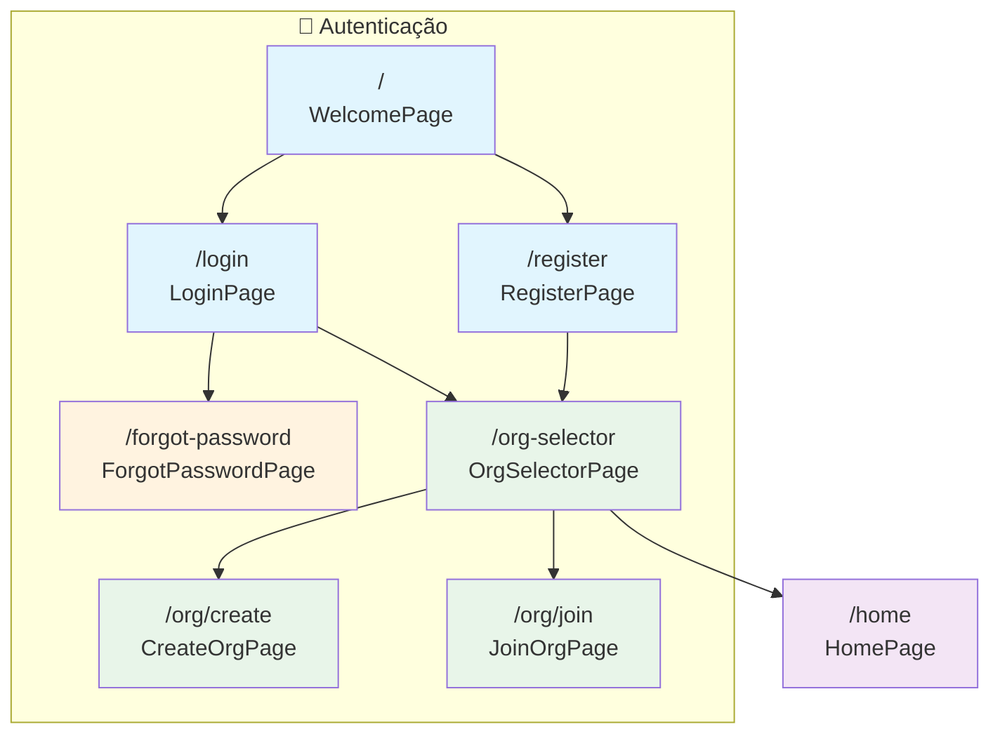

---

## 2. Visão Student/Aluno

O aluno acessa treinos, dieta, acompanha progresso e se comunica com profissionais.

```mermaid
flowchart TD
    subgraph nav["📱 Navegação Principal"]
        Home["/home\n🏠 Home"]
        Workouts["/workouts\n💪 Treinos"]
        Nutrition["/nutrition\n🥗 Dieta"]
        Progress["/progress\n📈 Progresso"]
        Chat["/chat\n💬 Chat"]
    end

    subgraph workouts_sub["Módulo Treinos"]
        WorkoutDetail["/workouts/:id\nDetalhes do Treino"]
        ActiveWorkout["/workouts/active/:id\nTreino Ativo"]
        Templates["/workouts/templates\nTemplates"]
        ProgramDetail["/programs/:id\nDetalhes Programa"]
    end

    subgraph nutrition_sub["Módulo Nutrição"]
        FoodSearch["/nutrition/search\nBuscar Alimento"]
        Barcode["/nutrition/barcode\nScanner Código"]
        RecentMeals["/nutrition/recent\nRefeições Recentes"]
        AISuggestion["/nutrition/ai-suggestion\nSugestão IA"]
        MealLog["/nutrition/meal-log\nRegistro Refeições"]
        NutritionSummary["/nutrition/summary\nResumo Nutricional"]
    end

    subgraph progress_sub["Módulo Progresso"]
        RegisterWeight["/progress/weight\nRegistrar Peso"]
        Measurements["/progress/measurements\nMedidas Corporais"]
        WeightGoal["/progress/goal\nMeta de Peso"]
        ProgressStats["/progress/stats\nEstatísticas"]
        PhotoComparison["/progress/photos/compare\nComparar Fotos"]
    end

    subgraph chat_sub["Módulo Chat"]
        TrainerChat["/trainer-chat\nChat com Trainer"]
        NutritionistChat["/nutritionist-chat\nChat com Nutricionista"]
    end

    Home --> Workouts
    Home --> Nutrition
    Home --> Progress
    Home --> Chat

    Workouts --> WorkoutDetail
    Workouts --> Templates
    WorkoutDetail --> ActiveWorkout
    Workouts --> ProgramDetail

    Nutrition --> FoodSearch
    Nutrition --> Barcode
    Nutrition --> RecentMeals
    Nutrition --> AISuggestion
    Nutrition --> MealLog
    Nutrition --> NutritionSummary

    Progress --> RegisterWeight
    Progress --> Measurements
    Progress --> WeightGoal
    Progress --> ProgressStats
    Progress --> PhotoComparison

    Chat --> TrainerChat
    Chat --> NutritionistChat

    style Home fill:#e3f2fd
    style Workouts fill:#fff3e0
    style Nutrition fill:#e8f5e9
    style Progress fill:#fce4ec
    style Chat fill:#f3e5f5
```

### Fluxo de Treino Ativo

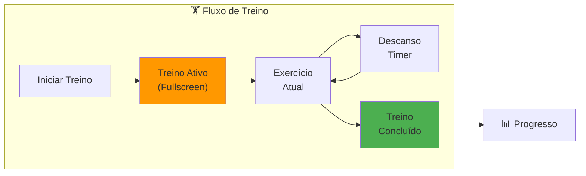

---

## 3. Visão Trainer/Coach

O Personal Trainer gerencia alunos, cria treinos e acompanha evolução.

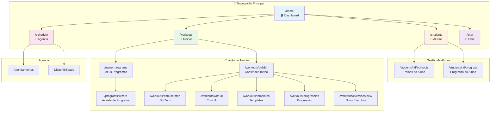

### Fluxo de Criação de Treino

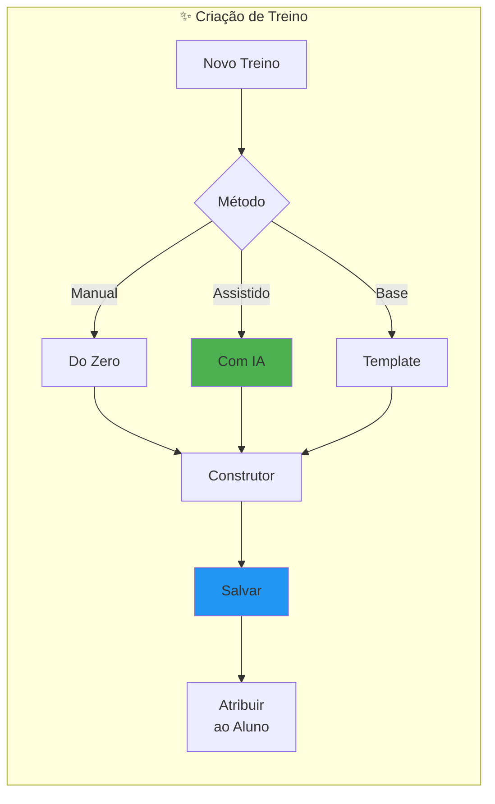

---

## 4. Visão Nutritionist

O Nutricionista gerencia pacientes e cria planos alimentares personalizados.

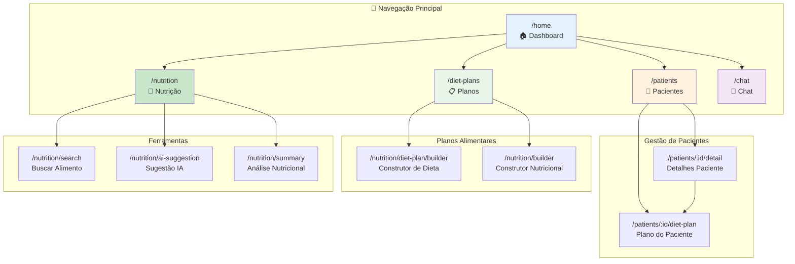

### Fluxo de Criação de Plano Alimentar

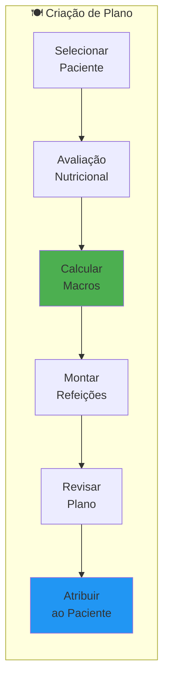

---

## 5. Visão Gym Owner/Admin

O proprietário/administrador da academia gerencia equipe, membros e finanças.

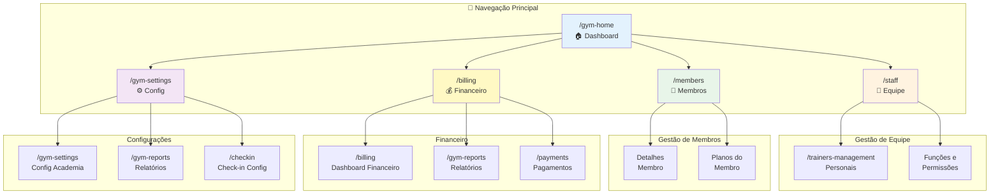

### Sistema de Check-in

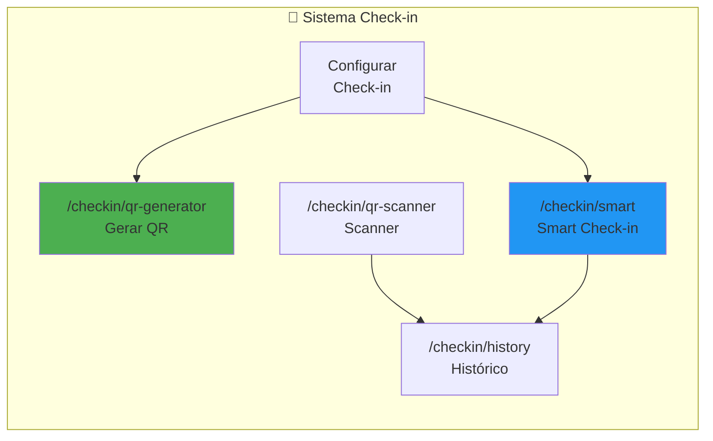

---

## 6. Telas Compartilhadas

Telas acessíveis por todos os perfis de usuário.

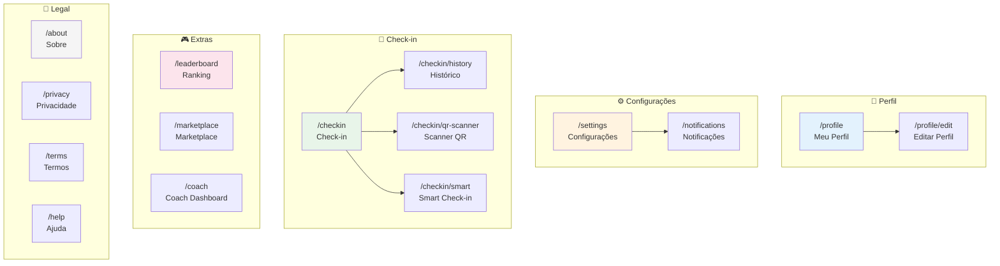

### Marketplace

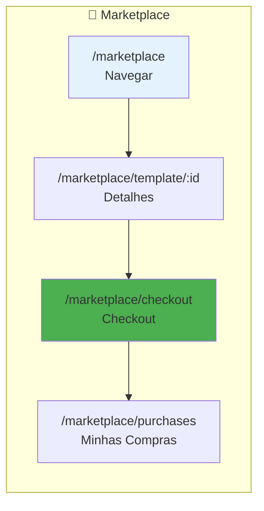

---

## Resumo de Rotas por Perfil

| Perfil | Rotas Exclusivas | Rotas Compartilhadas |
|--------|------------------|----------------------|
| **Student** | `/workouts/active/*`, progresso pessoal | Home, Workouts, Nutrition, Progress, Chat |
| **Trainer** | `/students/*`, `/trainer-programs`, `/schedule` | Workouts, Chat, Profile |
| **Coach** | Mesmas do Trainer | Mesmas do Trainer |
| **Nutritionist** | `/patients/*`, `/diet-plans` | Nutrition, Chat, Profile |
| **Gym Owner** | `/gym-*`, `/staff`, `/members`, `/billing` | Settings, Profile |
| **Gym Admin** | Mesmas do Gym Owner | Mesmas do Gym Owner |

---

## Legenda de Cores

| Cor | Significado |
|-----|-------------|
| 🔵 Azul claro | Dashboard/Home |
| 🟠 Laranja | Gestão de pessoas |
| 🟢 Verde | Treinos/Nutrição |
| 🌸 Rosa | Progresso/Agenda |
| 🟣 Roxo | Comunicação |
| 🟡 Amarelo | Financeiro |

---

*Documento gerado automaticamente. Última atualização: Janeiro 2026*
